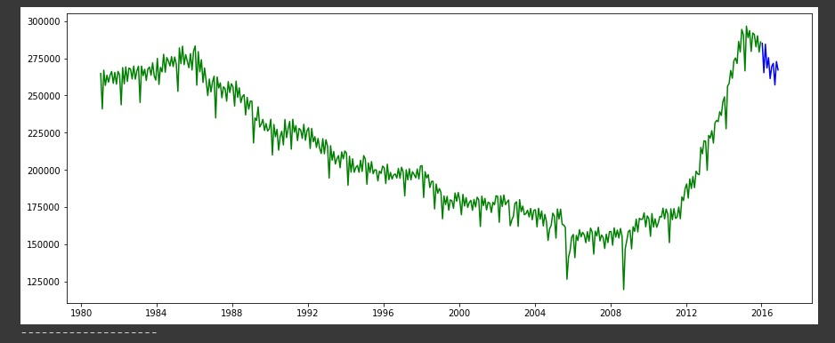
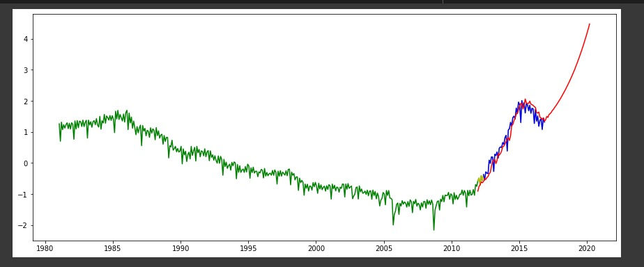
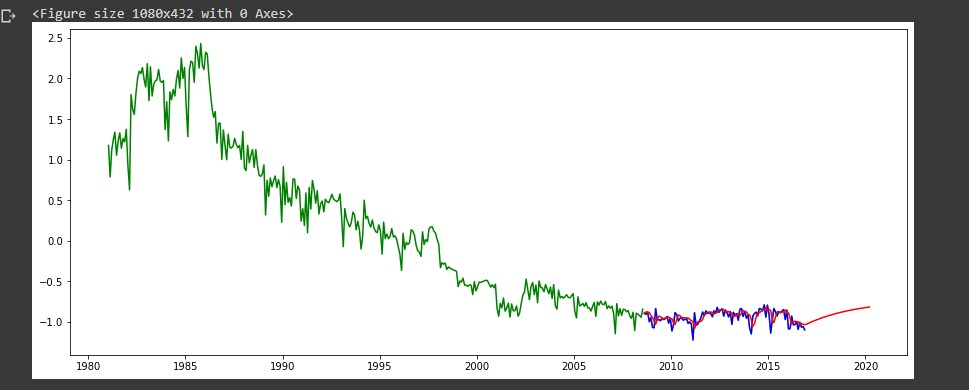

## Logistic Regression Model for Oil Production Trends

### Overview

This project implements a Logistic Regression model to predict trends in oil production across various states in the United States. The model is trained on data from the earliest year till 2015 and tested on the year 2016. The system also includes a web interface that allows users to upload the dataset and view statistical information across states on a map.

### System Specification

- **Model Development:** Logistic Regression model for predicting oil production trends.
- **Training Data:** Data from the earliest year till 2015.
- **Testing Data:** Year 2016.
- **Web Interface Features:**
  - Dataset upload functionality.
  - Display of statistical information on a map.
  - Dynamic filtering by year.
  - Trendline visualization for selected states.

### Technologies Used

- Django (Backend)
- React JS (Frontend)

### Installation

1. Clone the repository:

   ```bash
   git clone https://github.com/your-username/your-repo.git
    ```
2. Install backend dependencies:

   ```bash
   cd backend
   pip install -r requirements.txt
   ```

3. Install frontend dependencies:

   ```bash
   cd frontend
   npm install
   ```

4. Run the development server:

   ```bash
   cd backend
   python manage.py runserver
   ```

   ```bash
   cd frontend
   npm start
   ```

5. Access the application at [http://localhost:3000](http://localhost:3000).

### Usage

1. Upload the dataset using the web interface.
2. Explore statistical information on the map with dynamic year filtering.
3. Click the trend button to visualize the predicted trendline against the actual 2016 data.

### Screenshots




